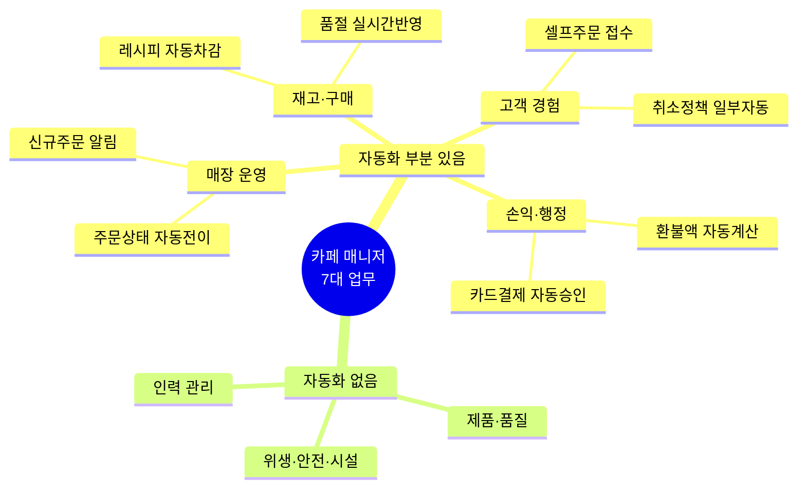
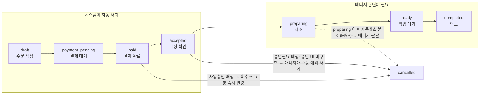
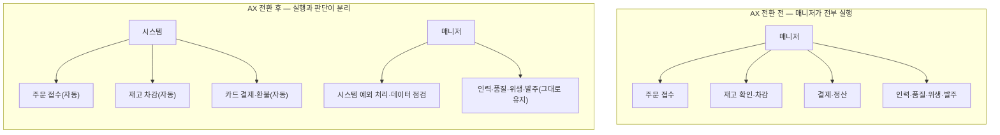

# 카페 매니저 AX 전환 직무기술서

> 근거: [직무기술서 상세판](cafe-manager-job-description.md)의 업무 7개 영역 + MGRV-Project 자사 제품(MangroveCafeOrder: 고객 셀프주문 앱·iPad POS·Supabase 백엔드)의 설계 문서.
> 작성일: 2026-08-07

## 0. 이 문서의 목적과 한계 — 먼저 읽을 것

**목적.** 기존 리서치가 정리한 '카페 매니저 실제 업무 7가지'를 기준으로, MangroveCafeOrder(주문·결제·POS 시스템) 도입 시 어느 업무가 자동화·보조되고 어느 업무가 그대로 사람 책임으로 남는지 매핑해, AX(자동화) 전환 이후의 매니저 직무기술서를 재정의한다.

**한계.**

- 이 매핑은 실제 매장 도입·검증 데이터가 아니라 MGRV 자사 시스템 설계 문서([`shared/SYSTEM_ARCHITECTURE.md`](https://github.com/MGRV-Project/shared/blob/main/SYSTEM_ARCHITECTURE.md), [`docs/API_INTERFACE_SPEC_V1.md`](https://github.com/MGRV-Project/docs/blob/main/API_INTERFACE_SPEC_V1.md) 등, MVP 설계 단계) 근거다.
- "AX"라는 이름과 달리 현재 MVP 범위에서 수요예측·추천·자동배차 같은 AI/ML 기능은 확인되지 않는다. 확인되는 것은 주문·결제·재고차감·알림의 **디지털 자동화 파이프라인**이며, 이 문서는 이를 넓은 의미의 AX(자동화 전환)로 다룬다.
- 일부 기능은 설계만 되어 있고 아직 동작하지 않는다 — 예: 승인 필요 모드 매장의 점주 승인 UI/워크플로우는 `backend#7`에서 명시적으로 범위 밖(로드맵 상태). 아래 표에서 "설계됨"과 "동작함"을 구분한다.
- PG(결제대행사)가 아직 미확정이라 정산 자동화의 최종 수준은 계약에 따라 달라질 수 있다.
- [원 리서치](cafe-manager-job-description.md)의 7개 업무 영역 자체도 채용공고·BLS/O*NET 등 2차 자료 기반 종합이며 판정 `REVISE 78/100`이 붙어 있다 — 이 문서는 그 위에 자사 제품 범위를 얹은 것이라 불확실성이 누적된다.

## 1. 업무 영역별 AX 전환 매핑

7개 영역을 자동화 여부로 나누면 아래와 같다. "자동화 부분 있음" 4개 영역도 영역 전체가 아니라 **규칙이 명확한 하위 작업만** 자동화된다는 점에 유의.

| 영역 | 기존 매니저 업무 | MangroveCafeOrder가 대신하는 부분 | 자동화 수준 | 매니저에게 남는 일 |
|---|---|---|---|---|
| 매장 운영 | 오픈·마감 점검, 피크타임 배치, 인수인계 | 주문 상태 자동 전이(`draft→payment_pending→paid→accepted→preparing→ready→completed`), 신규 주문 알림음·FCM/APNs 푸시로 주문 인지 자동화 | 부분 — 주문 흐름 가시화·알림만 | 포지션 배치, 오픈·마감 체크리스트, 인수인계, 피크타임 병목 판단 |
| 인력 관리 | 채용, 스케줄, 교육·코칭, 근태·갈등 관리 | 해당 없음(스케줄링·근태 기능 미확인) | 없음 | 전부 그대로 |
| 제품·품질 | 레시피 기준 확인, 맛·제공상태 점검, 메뉴 개선 | 메뉴 판매가능 여부(`is_available`) 온오프 제어만 | 낮음 — 메뉴 노출 제어만 | 레시피 기준 확인, 맛·제공상태 점검, 메뉴 개선 |
| 재고·구매 | 수요예측·발주, 입고검수, 실사, 유통기한, 폐기 관리 | 판매 시 원재료-레시피 자동 차감, 품절 시 `catalog-availability` 채널로 실시간 반영 | 부분 — 차감·품절 반영은 자동, 발주는 사람 | 수요예측, 발주, 입고검수, 재고 실사, 유통기한·폐기 관리 |
| 위생·안전·시설 | 청소·위생기록, 장비점검, 사고예방 | 해당 없음 | 없음 | 전부 그대로 |
| 고객 경험 | 현장 응대, 대기관리, 불만 해결 | 비회원 익명세션 셀프주문, 주문상태 실시간 안내, 취소 정책(자동승인/승인반려 설정) | 부분 — 접수·상태안내·단순취소만 자동, 승인 필요 모드의 실제 승인 흐름은 **설계만 되고 미구현** | 대면 응대, 대기 흐름 관리, 불만 해결, 시스템이 못 푸는 취소·환불 예외 처리 |
| 손익·행정 | 현금·카드 정산, 원가·인건비·예산 확인, 급여기록, 보고 | 결제 승인·실패 자동 처리, 전체·부분 환불 처리, 환불가능액(`remaining_refundable_amount`) 자동 계산, 주문 금액 서버 재계산(위변조 방지) | 부분 — 카드결제·환불 정산만 자동, 현금 정산·인건비·예산은 범위 밖 | 현금 정산, 원가·인건비·예산 확인, 급여기록, 보고 |

### 1-1. 주문 라이프사이클과 자동화 경계

7개 영역 중 매장 운영·고객 경험·손익 행정 3개가 걸쳐 있는 "주문 처리" 흐름을 상태 전이 기준으로 펼치면, 자동화 구간과 매니저 판단이 필요한 구간의 경계가 분명해진다.

**읽는 법.** `paid`까지는 결제·재고 확인이 규칙대로 자동 처리된다. `accepted` 이후 실제 제조·픽업 구간(`preparing→ready→completed`)과, 취소가 매장 정책이나 시스템 미구현 범위에 걸리는 모든 경우는 매니저가 직접 판단한다.

## 2. AX 전환 후 매니저 직무기술서

### 2-1. 축의 이동

기존 정의([상세판](cafe-manager-job-description.md) 1절)에서 매니저는 "사람·상품·공간·돈을 조율해 매장을 매일 같은 품질로 돌리는 현장 책임자"였다. AX 전환 후에도 이 정의는 유지되지만, **정형적 반복 업무(주문 접수, 재고 차감, 카드 정산)가 시스템으로 넘어가면서 매니저의 비중이 "실행"에서 "예외 처리 + 의사결정"으로 이동**한다.

7개 영역 중 자동화 부분이 있는 곳은 매장 운영·재고 구매·고객 경험·손익 행정 4개이며, 그마저도 **차감·정산·안내처럼 규칙이 명확한 부분만** 자동화되고, 인력 관리·제품 품질·위생 안전 시설 3개 영역은 그대로 남는다. 즉 절약되는 시간은 업무 전체가 아니라 각 영역의 "반복 실행 파트"에 한정된다.

### 2-2. 새로 생기는 일

기존 7개 업무 위에, 시스템 도입으로 다음이 추가된다.

- **시스템 예외 모니터링** — 결제 실패, 재고 자동차감과 실물 재고 불일치, 취소 요청 중 승인이 필요한데 처리 화면이 없는 케이스(현재 로드맵 상 미구현) 확인
- **데이터 기반 점검** — 자동 집계된 매출·판매구성·환불 내역을 정기적으로 확인해 이상치 파악
- **장애 대응** — 앱·POS·결제 장애 시 수동 주문 접수·현금 결제 등 대체 운영 절차 실행

### 2-3. 필요 역량 변화

| 구분 | 기존 | AX 전환 후 추가 |
|---|---|---|
| 유지 | 인력관리, 위생·안전 판단, 현장 서비스 회복, 손익 감각 | — |
| 신규 | — | POS·주문 앱 운영, 결제 예외(승인 실패·환불 분쟁) 대응, 재고-레시피 매핑 오류 트러블슈팅, 앱/POS 장애 시 수동 운영 전환 |

## 3. 성과 지표(KPI) 변화

[상세판](cafe-manager-job-description.md) 5절의 기존 KPI(매출, 제품, 속도·고객, 재고·원가, 인력, 위생·시설, 정산)는 그대로 유지한다. 여기에 시스템 운영 관련 지표를 추가한다.

- 앱 주문 전환율·이탈률
- 재고 자동차감 정확도(정기 실사 대비 차이)
- 결제 실패율, 환불 처리 소요 시간
- 시스템 장애 발생 빈도·대응 시간

기존 리서치의 경고(상세판 5절)와 동일하게, 이 지표들도 하나만 밀어붙이면 부작용이 생긴다 — 예를 들어 재고 자동차감 정확도만 관리하면 레시피 등록 자체를 단순화해 메뉴 다양성이 줄어들 수 있다. 매출·고객·품질·사람·비용과 함께 봐야 한다는 원칙은 AX 전환 후에도 동일하게 적용된다.

## 4. 요약

- 자동화되는 것: 주문 접수·상태 전이, 재고 차감, 품절 반영, 카드 결제·환불 정산 — 모두 **규칙이 정해진 반복 실행**이다.
- 자동화되지 않는 것: 인력 관리, 제품 품질, 위생·안전·시설, 현장 고객 응대, 발주 의사결정, 현금 정산 — **판단이 필요한 업무**다.
- 매니저 직무는 사라지지 않고, 실행자에서 시스템 예외 처리자·데이터 기반 의사결정자로 축이 이동한다.
- 이 매핑은 자사 제품의 설계 문서 기준이며 실제 도입 검증 데이터가 아니다 — 매장 파일럿 이후 갱신이 필요하다.

## 출처

- [카페 매니저 직무기술서 상세판](cafe-manager-job-description.md)
- [카페 매니저 리서치 원문](cafe-manager-research.md)
- [MGRV-Project/shared — SYSTEM_ARCHITECTURE.md](https://github.com/MGRV-Project/shared/blob/main/SYSTEM_ARCHITECTURE.md)
- [MGRV-Project/shared — RESEARCH.md](https://github.com/MGRV-Project/shared/blob/main/RESEARCH.md)
- [MGRV-Project/docs — API_INTERFACE_SPEC_V1.md](https://github.com/MGRV-Project/docs/blob/main/API_INTERFACE_SPEC_V1.md)
- [MGRV-Project/docs — POS_COMPETITOR_RESEARCH.md](https://github.com/MGRV-Project/docs/blob/main/POS_COMPETITOR_RESEARCH.md)
