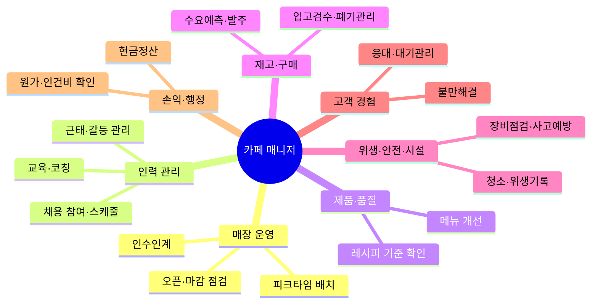
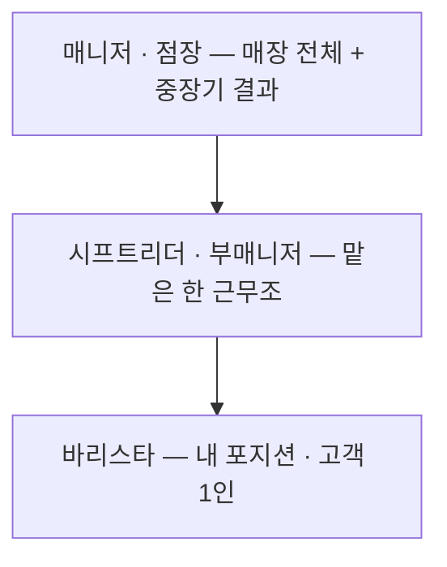

# 카페 매니저 직무기술서 (상세판)

> [감사 조서](cafe-manager-dossier.html)에서 조사방법론·정정서사·커뮤니티리스크·매장형태 등 메타 섹션을 걷어내고, 핵심 6개 영역만 [리서치 원문](cafe-manager-research.md) 수준으로 상세히 정리했다.
> 작성일: 2026-08-04

## 1. 결론 — 매니저란 무엇인가

카페 매니저는 가장 숙련된 바리스타가 아니라 **사람·상품·공간·돈을 조율해 매장이 매일 같은 품질로 돌아가게 만들고, 그 운영 결과에 책임지는 현장 책임자**다. 음료 제조와 고객 응대도 하지만, 직급을 가르는 핵심은 직접 만드는 양이 아니라 다음 네 가지 책임이다.

1. **인력** — 필요한 시간에 필요한 인력을 배치하고 팀의 수행 수준을 높인다.
2. **운영** — 재고·발주·품질·위생·설비를 관리해 영업 중단과 손실을 막는다.
3. **고객** — 혼잡과 불만을 해결해 고객 경험을 지킨다.
4. **숫자** — 매출·원가·인건비·현금·기록을 확인하고 개선한다.

### 정의의 근거

미국 노동통계국(BLS)은 식음료 매니저를 **일상 운영, 직원 지휘, 고객 만족과 사업 효율을 함께 책임지는 직무**로 정의한다. 국내 민간 카페의 공개 채용공고(바리스타·디저트 매니저)에서도 제조·고객 응대와 함께 식재·발주, 매출, 직원·스케줄 관리가 한 직무로 묶여 있었다 — 제조 능력만이 아니라 **운영 전반을 통제하는 역할**이라는 정의가 국내외 자료에서 일관되게 나타난다.

이 정의는 '매장 전체를 맡는 매니저'의 최대 책임 범위를 정리한 것이다. 실제로는 점주나 본사가 채용·급여·구매·마케팅을 가져가기도 하므로, 직함보다 **무엇을 결정할 권한이 있는지**를 확인해야 한다.

> **참고.** 국내 공공기관(구청 직영) 채용공고 2건은 원문 재검증 결과 일반 민간 매니저 채용이 아닌 것으로 확인되어 이 정의의 근거에서 제외했다 — 상세는 6번 한계 참고.

## 2. 실제 업무 7가지

O*NET·BLS·국내 채용공고·국내 직무분석 리포트(한국기술교육대학교 계열 연구, "카페매니저 직무 분석과 직무학습")가 공통으로 가리키는 7개 영역.

| 영역 | 구체적으로 하는 일 | 잘하고 있다는 신호 |
|---|---|---|
| 매장 운영 | 오픈·마감 점검, 피크타임 포지션 배치, 업무 우선순위 조정, 인수인계 | 혼잡해도 서비스가 무너지지 않고 영업 중단이 적음 |
| 인력 관리 | 채용 참여, 스케줄 작성, 역할 배정, 교육·코칭, 근태·갈등·성과 관리 | 필요한 시간대에 숙련 인력이 있고 결근·퇴사가 운영을 흔들지 않음 |
| 제품·품질 | 레시피·제조 기준 확인, 맛과 제공 상태 점검, 메뉴 개선 | 직원과 시간대가 달라도 맛·양·모양이 일정함 |
| 재고·구매 | 수요 예측, 발주, 입고 검수, 보관, 유통기한, 실사, 폐기 관리 | 품절과 과잉재고가 모두 적고 장부와 실물이 맞음 |
| 위생·안전·시설 | 청소 기준, 식품위생 기록, 장비 상태, 수리, 방충·폐기물, 사고 예방 | 점검 결함과 사고가 적고 장비 고장이 신속히 처리됨 |
| 고객 경험 | 현장 응대, 대기 흐름 관리, 불만 해결, 단골 관계 | 재방문을 해치는 불만이 줄고 문제가 현장에서 종결됨 |
| 손익·행정 | 매출·현금 정산, 원가·인건비·예산 확인, 급여·운영 기록, 보고 | 매출 증가가 이익과 함께 나타나며 숫자 차이가 설명됨 |

O*NET의 2026년 자료에서 중요도가 높은 핵심 과업은 현금·입금, 직원 및 고객서비스 기준 설정, 위생 기록, 스케줄과 업무 배정, 불만 해결, 식품·장비 재고, 예산·급여 기록, 납품 검수, 교육·채용·평가였다. 또한 **필요하면 직접 제조·서빙에 투입되는 것**도 핵심 과업으로 분류한다.

## 3. 하루는 보통 이렇게 흘러간다

여러 직무자료를 합쳐 재구성한 대표적인 흐름. 매장 영업시간과 본사 분업 수준에 따라 달라진다.

```mermaid
flowchart LR
    subgraph O["오픈 전"]
        direction TB
        o1["출근·결원·포지션 확인"]
        o2["냉장·유통기한·소모품·머신·POS 점검"]
        o3["시재·예약·프로모션 확인 후 우선순위 공유"]
    end
    subgraph P["피크타임"]
        direction TB
        p1["주문량에 따라 인력 재배치·병목 해소"]
        p2["품질·대기시간·청결·고객반응 동시 관리"]
        p3["밀리면 직접 투입, 큰 불만·사고는 매니저가 처리"]
    end
    subgraph Q["한가한 시간"]
        direction TB
        q1["발주·입고·재고실사, 스케줄·근태·교육·면담"]
        q2["매출·판매구성·폐기·인건비 확인 후 발주량 조정"]
        q3["시설수리·납품업체·본사(점주) 소통"]
    end
    subgraph R["마감"]
        direction TB
        r1["현금·카드·POS 대조, 폐기·재고·사고 기록"]
        r2["장비세척·식품보관·전원문단속·다음날 준비 확인"]
        r3["미해결 이슈·부족재고 다음 근무자 인계"]
    end
    O --> P --> Q --> R
```

BLS는 매니저가 혼잡할 때 서빙·결제·정리를 돕고, 청소·시설 유지보수, 예산·비용, 급여·직원기록, 마감 현금과 장비·잠금 상태까지 책임진다고 설명한다.

## 4. 바리스타 · 시프트리더 · 매니저의 차이

| 역할 | 책임의 단위 | 핵심 질문 |
|---|---|---|
| 바리스타 | 자신의 포지션과 고객 한 명의 경험 | "이 주문을 정확하고 친절하게 완성했는가?" |
| 시프트리더·부매니저 | 자신이 맡은 한 근무조 | "이 시간대의 인력과 흐름을 안정적으로 운영했는가?" |
| 매니저·점장 | 매장 전체와 중장기 결과 | "이 매장이 사람과 숫자 양쪽에서 지속 가능하게 운영되는가?" |

스타벅스의 공식 직무 소개도 바리스타는 음료 제조와 환대, 시프트 슈퍼바이저는 근무조 운영과 현장 의사결정, 매니저는 일상 운영부터 사업 성장·팀 육성까지 담당한다고 구분한다. 다만 이는 스타벅스가 채용을 목적으로 직접 작성·배포한 자사발행 콘텐츠로, 지원자 유인을 위해 매니저 역할을 실제보다 매력적으로 서술했을 가능성을 감안해야 한다.

이 3단 명칭과 체계는 스타벅스의 역할 구조다. 한국의 다른 브랜드나 개인 카페에서는 '리더·캡틴·부점장·매니저·점장'의 명칭과 권한이 다르고, 중간 직급이 아예 없을 수도 있다.

## 5. 성과 지표 · 업계 벤치마크

특정 브랜드의 의무 기준이 아니라, 7가지 업무를 실제로 관리하기 위한 권장 점수판.

- **매출:** 일·주·월 매출, 주문 건수, 객단가, 전년 또는 계획 대비 증감
- **제품:** 핵심 메뉴 품질 점검, 제조 오류·재제조, 품절 횟수
- **속도·고객:** 피크 대기시간, 불만 건수와 해결시간, 재방문 또는 만족도
- **재고·원가:** 재료원가율, 폐기율, 재고 차이, 긴급 발주 횟수
- **인력:** 인건비율, 시간당 매출 또는 주문 수, 결근, 교육 이수, 이직률
- **위생·시설:** 체크리스트 준수율, 점검 지적, 사고, 장비 고장·복구시간
- **정산:** 현금·POS 차이, 누락 기록과 수정 건수

> ⚠ **한 지표만 밀어붙이면 부작용이 생긴다.** 인건비율만 낮추면 대기시간과 직원 소진이 커질 수 있고, 폐기율만 낮추면 품절이 늘 수 있다. **매출·고객·품질·사람·비용을 함께** 봐야 한다.

### 확보된 업계 벤치마크

| 항목 | 권장 상한 | 출처 |
|---|---|---|
| 재료원가율 | 30% 이내 | 배민외식업광장(35평 이하 카페 기준) |
| 인건비율 | 30% 이내 | 배민외식업광장 |
| 임대료율 | 10% 이내 | 배민외식업광장 |
| 폐기율 | 미확보 | 정성적 언급("당일생산 당일폐기")만 확인 |

소형 매장은 처음부터 모든 지표를 수집하기보다 **일매출·주문 건수, 품절·폐기, 고객 불만, 결근, 정산 차이**부터 기록하는 편이 현실적이다. POS와 인력 시스템이 갖춰진 매장은 객단가, 메뉴별 판매구성, 원가·인건비율, 대기시간과 이직률까지 넓힐 수 있다.

## 6. 한계 — 여전히 못 채운 갭

- **국내 공공기관 공고 2건은 원문 PDF 대조 결과 일반 카페 매니저 채용이 아니다.** 노원구 공고("화랑대 철도공원 카페 기차가 있는 풍경매니저")는 노원구청이 직접 운영하는 관광지 부속 카페의 시간선택제 임기제공무원('마'급, 9급 상당) 채용이다 — 지방공무원법 적용, 임용기간 1년(연장 시 최대 5년), 주 35시간, 연봉 2,378만원(40시간 환산 상한 5,283만원). 강북구 공고("우이천 수변활력공간 재간정")는 강북구청이 운영하는 수변공간 부속 카페의 기간제 근로자 채용이며, 직위명은 '부매니저'이지만 담당업무 4개 전부 "~보조"로 명시되고 "기타 관리자가 지시하는 업무"라는 문구로 별도 상급 관리자가 존재함을 시사한다(시급 14,000원, 월 약 250만원). 즉 두 공고 모두 매장을 최종 책임지는 매니저가 아니라 지자체 소속 공무원·기간제 근로자가 상급 관리자 아래에서 카페 운영을 보조하는 자리다. 민간 프랜차이즈·개인 카페 매니저의 정규 고용조건을 대표하는 국내 근거는 잡코리아 민간 공고 1건뿐이다.
- 채용공고는 고용주가 기대하는 역할을 보여줄 뿐, 실제 권한·업무량·인센티브와 정확히 같다고 볼 수 없다. 공개 공고를 거의 내지 않는 소형 카페도 표본에서 빠져 있다.
- BLS와 O*NET은 미국의 식음료 매니저 자료로, 한국 카페의 법적·노무 세부 요건을 직접 설명하지는 않는다.
- 스타벅스 자료는 스타벅스가 채용을 목적으로 직접 작성·배포한 자사발행 콘텐츠로, 대형 프랜차이즈의 표준화된 업무를 보여주는 동시에 지원자를 유인하기 위해 매니저 역할을 실제보다 매력적으로 서술했을 가능성이 있다.
- 하루 흐름과 권장 KPI는 여러 출처의 공통 과업을 바탕으로 재구성한 분석이며 모든 매장에 동일하게 적용되는 규정이 아니다. KPI 세부 목록도 인용 자료 어디에도 구체 수치로 등장하지 않는, 분석자가 종합한 권장안이다 — 배민외식업광장 수치 외 업계 벤치마크는 별도 재조사가 필요하다.
- 커뮤니티 다각도 보강(블라인드·Reddit·잡플래닛·Threads)은 익명·자발적 게시물에 의존하며, 부정 자기선택 편향과 플랫폼별 인증 수준 차이를 완전히 통제하지 못한다.
- 네이버 카페(사장님 커뮤니티) 등 로그인 게이트로 막힌 국내 최대급 자영업자 커뮤니티는 검색 엔진에 인덱싱되지 않아 이번 조사에서도 접근하지 못했다.

## 출처

- [카페 매니저 리서치 원문](cafe-manager-research.md) — 전체 출처 목록 포함
